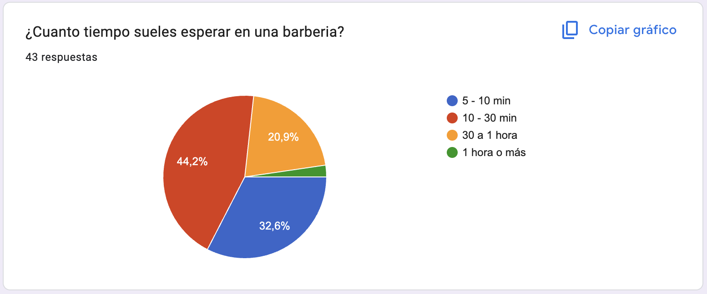
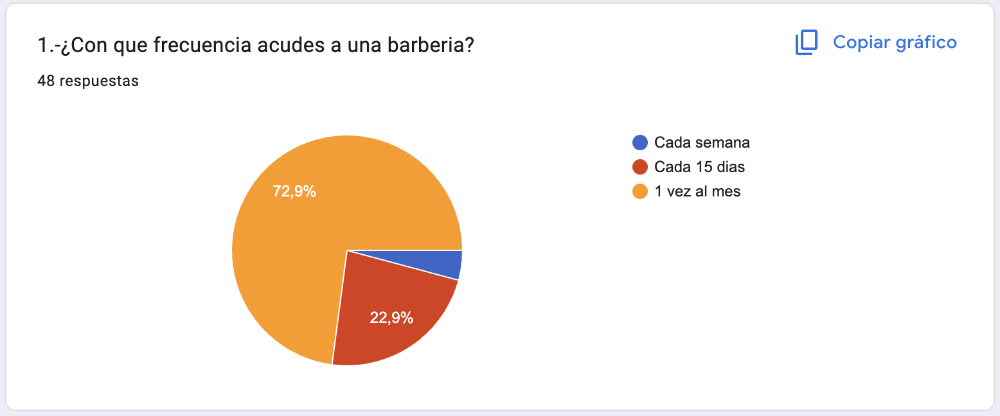
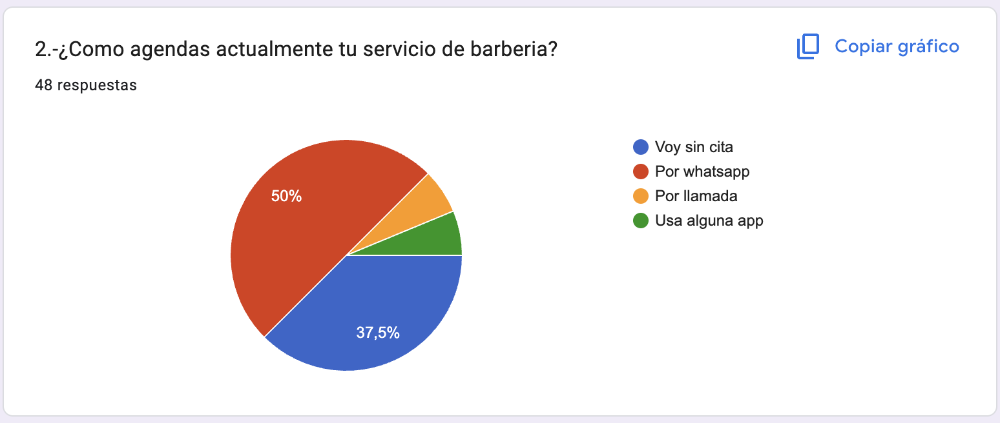
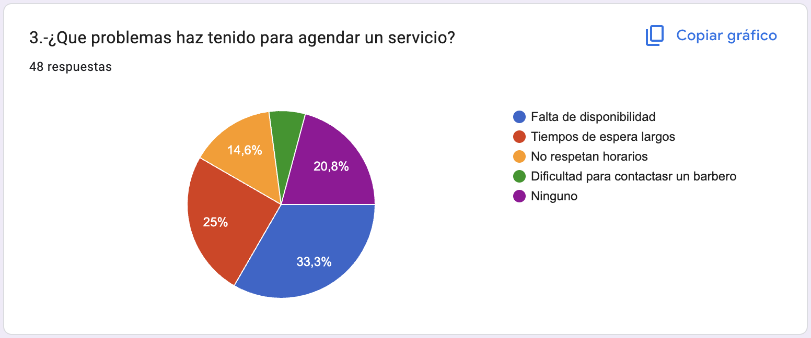
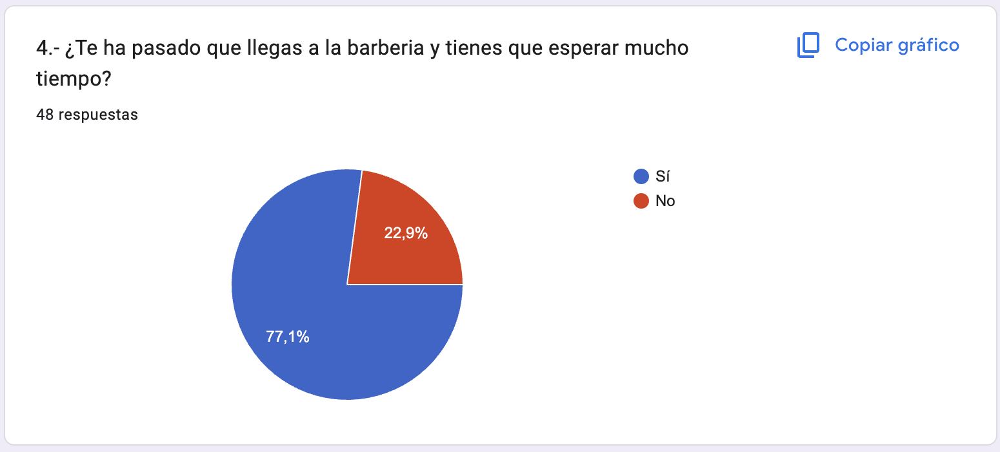
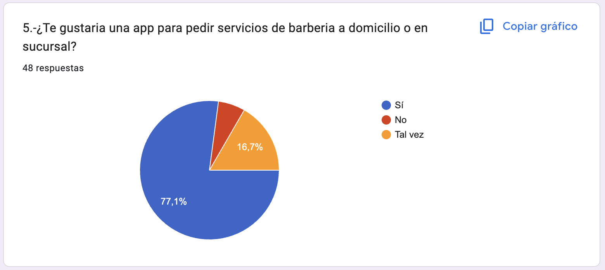
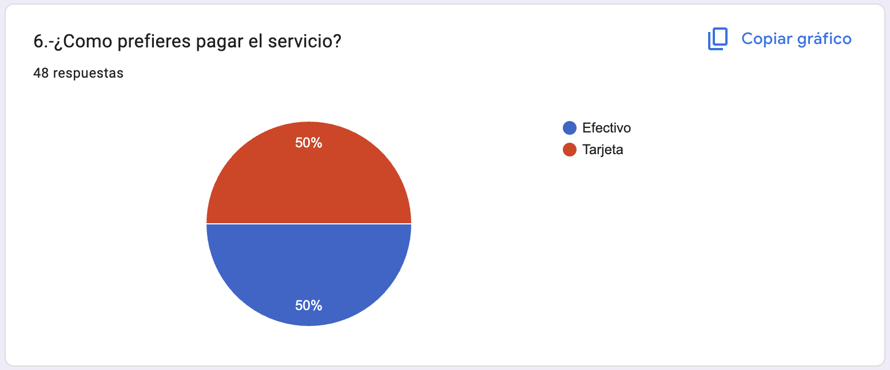
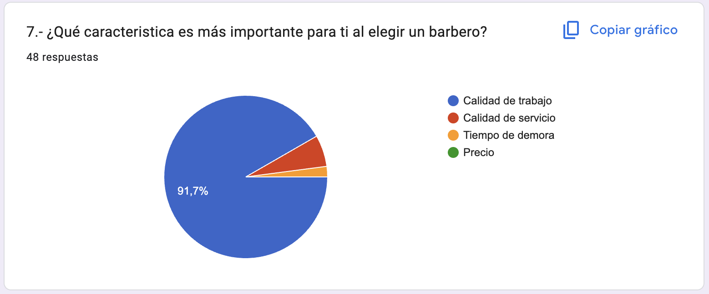
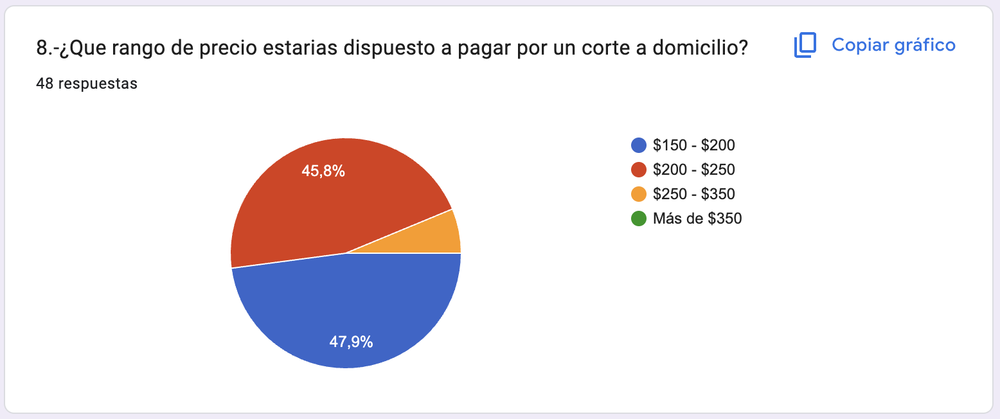
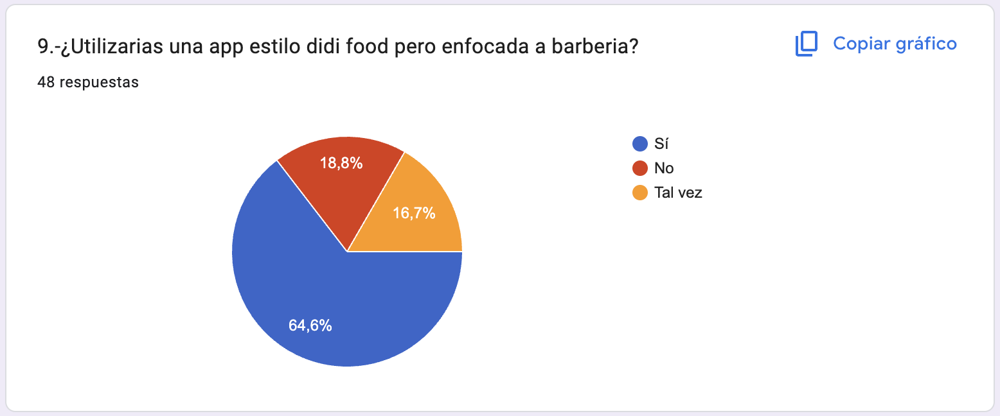

# Aplicación para servicios a domicilio de barbería bajo demanda **On-Demand**

La problemática central radica en la deficiente administración del tiempo en las barberías físicas, lo que genera esperas excesivas que afectan la productividad diaria de los clientes. Para resolver esto, se propone un sistema computacional basado en el modelo bajo demanda que traslade el servicio al domicilio del usuario, optimizando la rapidez y eficiencia del encuentro. A través de encuestas y entrevistas, se recolectarán datos sobre tiempos de espera, volumen de clientes afectados y competitividad de precios para validar el modelo. Cabe destacar que, debido a restricciones de presupuesto y conocimientos técnicos, el proyecto se centrará en la automatización logística y el monitoreo del servicio, dejando fuera la resolución de conflictos personales entre las partes y enfocándose en transformar un establecimiento estático en un servicio dinámico y puntual. Para sustentar el diseño, se analizarán datos sobre la distribución de productos, costos y la satisfacción del cliente obtenidos mediante métodos de investigación de campo. El sistema tiene como alcance mejorar la experiencia del usuario y la visibilidad de los profesionales, aunque posee limitaciones claras: no resolverá problemas de índole personal entre los involucrados y su desarrollo inicial estará sujeto a las restricciones técnicas y presupuestarias actuales, priorizando las funciones críticas de conexión y geolocalización. Es un sistema donde productos o servicios se entregan al instante, justo cuando el usuario los necesita, a través de plataformas digitales, ofreciendo inmediatez, flexibilidad y pago por uso.

## Datos Crudos
Hicimos una busqueda en sitios oficiales sobre los negocios de barberia en México y en Jalisco y obtuvimos esta información:

| Aspecto | México | Jalisco |
| :------- | :-------- | :--------|
| `N. de negocios` | Más de **290,000** establecimientos de cuidado personal (incluye barberías) | Alta concentración de barberías, uno de los estados líderes |
| `Servicios comunes` | Corte de cabello, barba, tintes, tratamientos faciales, manicura, masajes | Corte de barba, afeitado masculino, laminado de cejas, servicios premium |
| `Transformación digital` | Creciente adopción de apps para reservas, control de inventario y fidelización | Uso intensivo de apps como Booksy y Kumbio para citas y recordatorios |
| `Beneficios de apps` | Reducción de costes, mejor experiencia del cliente, productividad | Reservas online, confirmaciones automáticas por WhatsApp, control de stock |
| `Ejemplos de apps` | Booksy, Fresha, Kumbio, software de gestión | Booksy, Kumbio, Fresha (con presencia en municipios como Guadalajara, Tepatitlán) |
| `Clientes objetivo` | Jóvenes y adultos que buscan estilo y cuidado personal | Público urbano, especialmente en Guadalajara y municipios con alta demanda |
| `Tendencia del mercado` | Digitalización como ventaja competitiva, expansión del software | Profesionalización del sector, atracción de nuevos clientes vía apps |

Además realizamos un estudio basado en una muestra de 48 usuarios donde identificamos las tendencias, hábitos y áreas de oportunidad en el servicio de barbería actual. Se detallan puntos claves:

#### Análisis de hábitos y problemática actual

Frecuentemente el consumo es estable con un 72.9% de los usuarios asistiendo una vez al mes. Sin embargo el proceso de atención al cliente presenta deficiencias de un 44.2% donde los usuarios suelen esperar entre 10 a 30 minutos y un 77.1% afirma que ha experimentado esperas excesivas en un local. Esta ineficiencia nace de un sistema de agenda mayormente manual donde el 50% se realiza por la app de whatsapp y un 33.5% acuden sin cita. Los principales obstáculos detectados para obtener un servicio son la falta de disponibilidad con un 33.3% y los tiempos de espera son del 25%.

#### Preferencias del consumidor y propuesta de valor

Al elegir un barbero el usuario prioriza la calidad del trabajo con un 91.7% por encima de cualquier otro factor como el precio o la rapidez. En cuanto la forma de pago con un 50% prefieren efectivo y con otro 50% que optan por pagos con tarjeta lo que exige una oferta de pago bimodal. Con el servicio a domicilio el rango de precio que los usuarios estan dispuestos a pagar oscila entre los $150 a $250 MXN.

#### Conclusión y validación de la solución a la problemática

Existe una validación positiva para la introducción de una solución digital en el mercado. El 77.1% de los usuarios muestran interés en una aplicación para solicitar servicios y un 64.6% confirma que utilizará una plataforma con un modelo operativo a aplicaciones existentes adaptada a este mercado. El modelo tradicional de este mercado presenta una saturación y una desorganización que afecta la experiencia del cliente. La implementación de una plataforma tecnológica no sólo resolvería el problema de la gestión de tiempos y disponibilidad sino que también capturará un segmento importante en los usuarios que buscan comodidad y calidad, siempre que mantenga un estándar alto de servicio y se ofrezca flexibilidad en métodos de pago.

#### Gráficas de la encuesta

<table>
  <tr>
    <td width="50%" valign="top">
      <h4>¿Cuánto tiempo sueles esperar en una barbería?</h4>
      
    </td>
    <td width="50%" valign="top">
      <h4>¿Con qué frecuencia acudes a una barbería?</h4>
      
    </td>
  </tr>
  <tr>
    <td width="50%" valign="top">
      <h4>¿Cómo agendas actualmente tu servicio de barbería?</h4>
      
    </td>
    <td width="50%" valign="top">
      <h4>¿Qué problemas has tenido para agendar un servicio?</h4>
      
    </td>
  </tr>
  <tr>
    <td width="50%" valign="top">
      <h4>¿Te ha pasado que llegas a la barbería y tienes que esperar mucho tiempo?</h4>
      
    </td>
    <td width="50%" valign="top">
      <h4>¿Te gustaría una app para pedir servicios de barbería a domicilio o en sucursal?</h4>
      
    </td>
  </tr>
  <tr>
    <td width="50%" valign="top">
      <h4>¿Cómo prefieres pagar el servicio?</h4>
      
    </td>
    <td width="50%" valign="top">
      <h4>¿Qué característica es más importante para ti al elegir un barbero?</h4>
      
    </td>
  </tr>
  <tr>
    <td width="50%" valign="top">
      <h4>¿Qué rango de precio estarías dispuesto a pagar por un corte a domicilio?</h4>
      
    </td>
    <td width="50%" valign="top">
      <h4>¿Utilizarías una app estilo didi food pero enfocada a barbería?</h4>
      
    </td>
  </tr>
</table>

## Alcance

El proyecto se centra en el desarrollo de una plataforma digital que facilite la logística de servicios de barbería a domicilio. Incluye la automatización de la asignación de turnos, el monitoreo del servicio en tiempo real, la gestión de geolocalización para conectar al barbero más cercano con el cliente y la visibilidad de perfiles profesionales para mejorar la confianza del usuario. El objetivo final es transformar un servicio estático en uno dinámico y puntual.

## Limitaciones

- **Presupuestarias y Técnicas:** El desarrollo inicial se limitará a un Producto Mínimo Viable (MVP) debido a la restricción de fondos y conocimientos técnicos especializados.
- **Conflictos Interpersonales:** El sistema no tiene capacidad para intervenir o resolver disputas personales, malentendidos o problemas de actitud entre el barbero y el cliente.
- **Calidad Técnica del Corte:** El software monitorea la logística, pero no garantiza la pericia técnica o el talento artístico del barbero.

## Técnicas utilizadas

Primero realizamos una **lluvia de ideas**, donde pensé en diferentes ideas de aplicaciones y anoté posibles funciones. Después de analizarlas, fui descartando algunas hasta quedarme con la que mejor resolvía una necesidad real.
  
También aplicamos un **análisis de problemas**, identificando la dificultad que tienen algunas personas para acudir a una barbería y cómo una aplicación podría facilitar el acceso a este servicio a domicilio.

Además, hicimos una investigación de aplicaciones similares, revisando qué funcionalidades ofrecen, cuáles son sus ventajas y qué aspectos podrían mejorarse, lo cual me ayudó a ajustar mi propuesta.

Posteriormente, realizamos la **definición de requisitos**, donde listé las funciones principales que debía tener la aplicación, como el registro de usuarios, uso de mapas, agendado de citas y pagos.
Finalmente, utilizamos **prototipado**, realizando bocetos simples de las pantallas para tener una mejor idea de cómo funcionaría la aplicación antes de comenzar a programar.

## Referencias bibliograficas

  
 - Profeco [Profeco]. (2025, junio). BARBERÍAS Conoce qué servicios ofrecen y qué factores influyen en su costo. Revista del Consumidor. https://revistadelconsumidor.profeco.gob.mx/media/revistas/sumario/sumario_brujula_de_compra_2025_6_breDCrSY.pdf
  
 - Redacción. (2025, September 30). Cómo la tecnología ayuda a las barberías a reducir costes y mejorar la fidelización de clientes. Diario Siglo XXI. https://www.diariosigloxxi.com/texto-diario/mostrar/5449460/como-tecnologia-ayuda-barberias-reducir-costes-mejorar-fidelizacion-clientes
   
 - Tapia, E. C., & Tapia, E. C. (2024, September 19). Barberías y belleza en la era digital: La nueva forma de reservar citas en 2024. Emprendedor | El Medio Líder De Emprendimiento Y Negocios. https://emprendedor.com/barberias-y-belleza-en-la-era-digital-la-nueva-forma-de-reservar-citas-en-2024/

