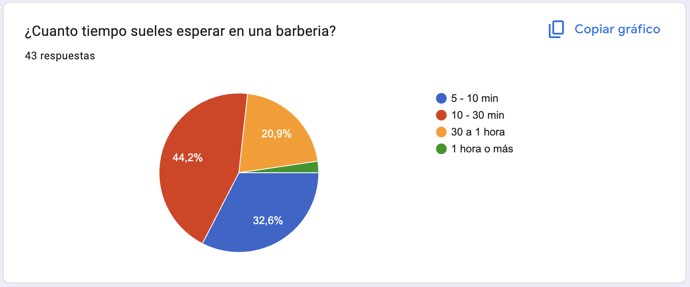
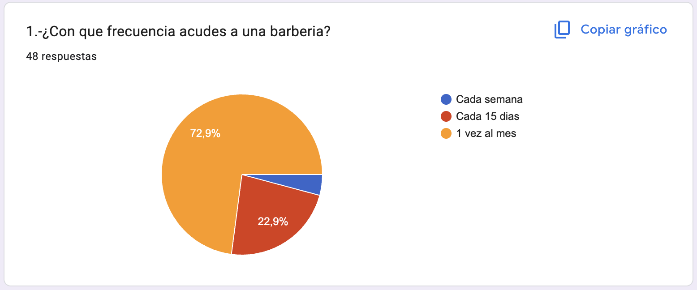
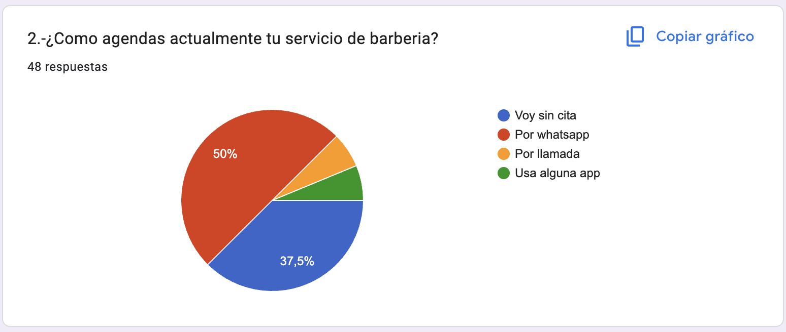
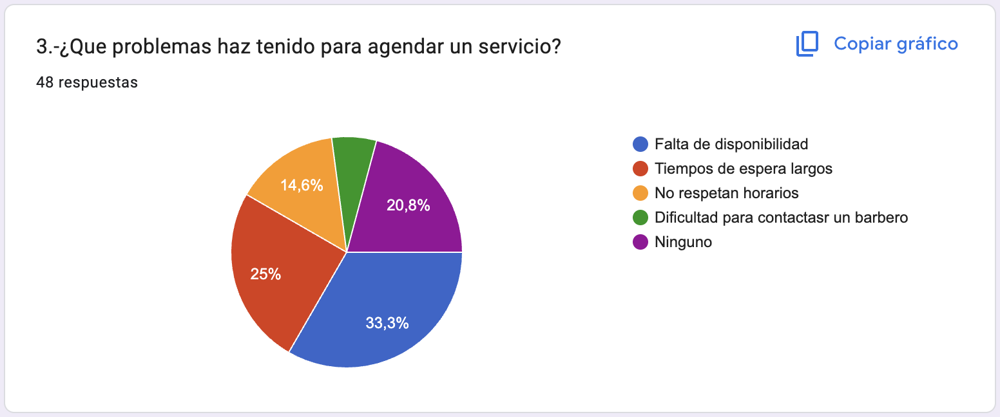
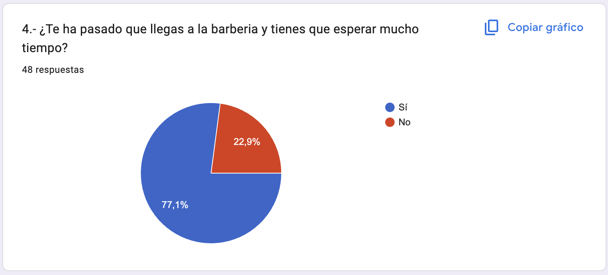
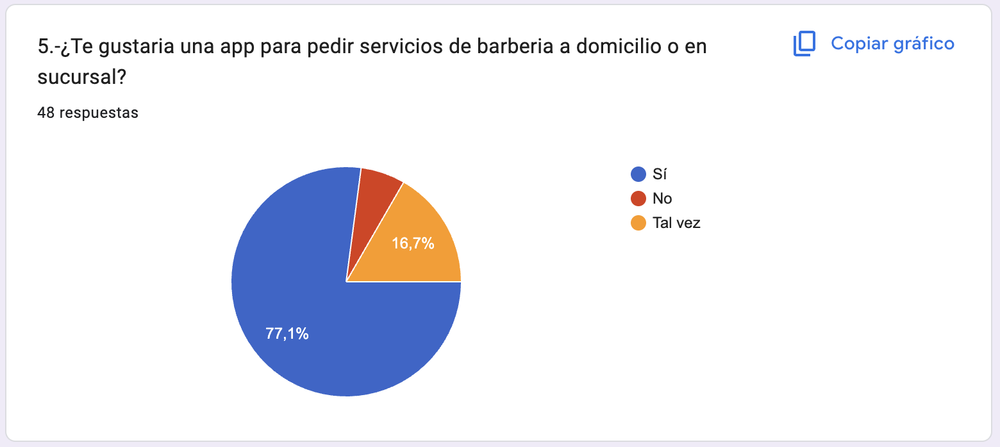
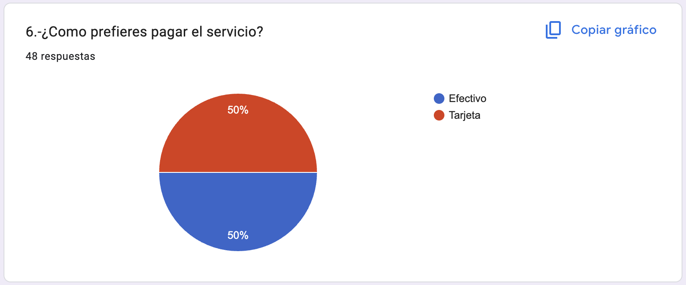
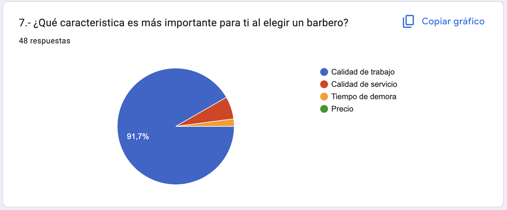
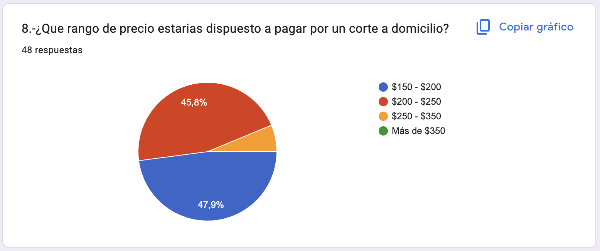
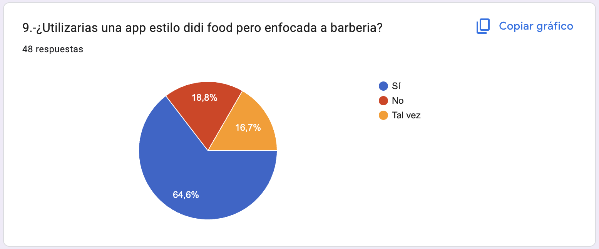

# BarberApp

<h1 align="center">
Sistema On-Demand para Servicios de Barbería
</h1>

<p align="center">
  
</p>

<p align="center">
  
  
  
  
  
</p>

---

# Tabla de Contenido

- [Descripción General](#-descripción-general)
- [Objetivos](#-objetivos)
- [Problemática](#️-problematica)
- [Datos Crudos](#-datos-crudos)
- [Gráficas de la Encuesta](#-gráficas-de-la-encuesta)
- [Alcance](#-alcance)
- [Limitaciones](#️-limitaciones)
- [Técnicas utilizadas](#-técnicas-utilizadas)
- [Tecnologías utilizadas](#️-tecnologías-utilizadas)
- [Estructura del proyecto](#️-estructura-del-proyecto)
- [Instalación y Configuración](#-instalación-y-configuración)
- [Uso de la aplicación](#-uso-de-la-aplicación)
- [Metodología de trabajo](#️-metodología-de-trabajo)
- [Colaboradores](#-colaboradores)
- [Estado del Proyecto](#-estado-del-proyecto)
- [Licencia](#-licencia)
- [Referencias bibliográficas](#-referencias-bibliograficas)

---

# Descripción General

<p align="justify">
BarberApp es una solución tecnológica bajo los modelos de economía bajo demanda y agenda, que conecta directamente a profesionales de barberías con clientes que requieren servicios a domicilio.
</p>

## Problemática que resuelve

- La pérdida de clientes en barberías tradicionales debido a tiempos de espera prolongados y una gestión de agendas ineficiente en la era digital.

## Público dirigido

- Usuarios que buscan comodidad y optimización de su tiempo.
- Barberos que desean expandir su radio de servicio y aumentar sus ingresos.

## Contexto

- Desarrollado como un proyecto de modernización para el sector de la estética personal, utilizando arquitecturas modernas de microservicios y comunicación en tiempo real.

---

# Objetivos

## Objetivos Específicos

<p align="justify">
BarberApp es una solución tecnológica bajo los modelos de economía bajo demanda y agenda, que conecta directamente a profesionales de barberías con clientes que requieren servicios a domicilio.
</p>

-  **Gestión de perfiles:** Implementar módulos de registro y administración para barberos y clientes usando los lenguajes **JavaScript** y **Dart**.

-  **Geolocalización avanzada:** Conectar al usuario con el profesional más cercano mediante SDKs nativos **Google Maps** y **Apple Maps**.

-  **Sincronización Real-Time:** Gestionar citas y notificaciones instantáneas mediante Express.

-  **Control de calidad:** Establecer mecanismos de retroalimentación y calificación del servicio.

---

# Problematica

<p align="justify">
La problemática central radica en la deficiente administración del tiempo en las barberías físicas, lo que genera esperas excesivas que afectan la productividad diaria de los clientes.
</p>

<p align="justify">
Para resolver esto, se propone un sistema computacional basado en el modelo bajo demanda que traslade el servicio al domicilio del usuario, optimizando la rapidez y eficiencia del encuentro.
</p>

<p align="justify">
A través de encuestas y entrevistas, se recolectarán datos sobre tiempos de espera, volumen de clientes afectados y competitividad de precios para validar el modelo.
</p>

<p align="justify">
Cabe destacar que, debido a restricciones de presupuesto y conocimientos técnicos, el proyecto se centrará en la automatización logística y el monitoreo del servicio, dejando fuera la resolución de conflictos personales entre las partes y enfocándose en transformar un establecimiento estático en un servicio dinámico y puntual.
</p>

<p align="justify">
Para sustentar el diseño, se analizarán datos sobre la distribución de productos, costos y la satisfacción del cliente obtenidos mediante métodos de investigación de campo.
</p>

<p align="justify">
El sistema tiene como alcance mejorar la experiencia del usuario y la visibilidad de los profesionales, aunque posee limitaciones claras:
</p>

- No resolverá problemas de índole personal entre los involucrados.
- Su desarrollo inicial estará sujeto a restricciones técnicas y presupuestarias actuales.
- Se priorizarán las funciones críticas de conexión y geolocalización.

<p align="justify">
Es un sistema donde productos o servicios se entregan al instante, justo cuando el usuario los necesita, a través de plataformas digitales, ofreciendo inmediatez, flexibilidad y pago por uso.
</p>

---

# Datos Crudos

<p align="justify">
Hicimos una búsqueda en sitios oficiales sobre los negocios de barbería en México y en Jalisco y obtuvimos esta información:
</p>

| Aspecto | México | Jalisco |
| :------- | :-------- | :--------|
| `N. de negocios` | Más de **290,000** establecimientos de cuidado personal (incluye barberías) | Alta concentración de barberías, uno de los estados líderes |
| `Servicios comunes` | Corte de cabello, barba, tintes, tratamientos faciales, manicura, masajes | Corte de barba, afeitado masculino, laminado de cejas, servicios premium |
| `Transformación digital` | Creciente adopción de apps para reservas, control de inventario y fidelización | Uso intensivo de apps como Booksy y Kumbio para citas y recordatorios |
| `Beneficios de apps` | Reducción de costes, mejor experiencia del cliente, productividad | Reservas online, confirmaciones automáticas por WhatsApp, control de stock |
| `Ejemplos de apps` | Booksy, Fresha, Kumbio, software de gestión | Booksy, Kumbio, Fresha (con presencia en municipios como Guadalajara, Tepatitlán) |
| `Clientes objetivo` | Jóvenes y adultos que buscan estilo y cuidado personal | Público urbano, especialmente en Guadalajara y municipios con alta demanda |
| `Tendencia del mercado` | Digitalización como ventaja competitiva, expansión del software | Profesionalización del sector, atracción de nuevos clientes vía apps |

---

<p align="justify">
Además realizamos un estudio basado en una muestra de 48 usuarios donde identificamos las tendencias, hábitos y áreas de oportunidad en el servicio de barbería actual.
</p>

## Análisis de hábitos y problemática actual

<p align="justify">
Frecuentemente el consumo es estable con un 72.9% de los usuarios asistiendo una vez al mes.
</p>

<p align="justify">
Sin embargo el proceso de atención al cliente presenta deficiencias de un 44.2% donde los usuarios suelen esperar entre 10 a 30 minutos y un 77.1% afirma que ha experimentado esperas excesivas en un local.
</p>

<p align="justify">
Esta ineficiencia nace de un sistema de agenda mayormente manual donde el 50% se realiza por la app de WhatsApp y un 33.5% acuden sin cita.
</p>

<p align="justify">
Los principales obstáculos detectados para obtener un servicio son la falta de disponibilidad con un 33.3% y los tiempos de espera son del 25%.
</p>

---

## Preferencias del consumidor y propuesta de valor

<p align="justify">
Al elegir un barbero el usuario prioriza la calidad del trabajo con un 91.7% por encima de cualquier otro factor como el precio o la rapidez.
</p>

<p align="justify">
En cuanto la forma de pago, un 50% prefieren efectivo y otro 50% optan por pagos con tarjeta, lo que exige una oferta de pago bimodal.
</p>

<p align="justify">
Con el servicio a domicilio el rango de precio que los usuarios están dispuestos a pagar oscila entre los $150 a $250 MXN.
</p>

---

## Conclusión y validación de la solución

<p align="justify">
Existe una validación positiva para la introducción de una solución digital en el mercado.
</p>

<p align="justify">
El 77.1% de los usuarios muestran interés en una aplicación para solicitar servicios y un 64.6% confirma que utilizará una plataforma con un modelo operativo similar a aplicaciones existentes adaptada a este mercado.
</p>

<p align="justify">
El modelo tradicional de este mercado presenta una saturación y una desorganización que afecta la experiencia del cliente.
</p>

<p align="justify">
La implementación de una plataforma tecnológica no sólo resolvería el problema de la gestión de tiempos y disponibilidad sino que también capturará un segmento importante en los usuarios que buscan comodidad y calidad, siempre que mantenga un estándar alto de servicio y se ofrezca flexibilidad en métodos de pago.
</p>

---

# Gráficas de la encuesta

<table>
  <tr>
    <td width="50%" valign="top">
      <h4>¿Cuánto tiempo sueles esperar en una barbería?</h4>
      
    </td>
    <td width="50%" valign="top">
      <h4>¿Con qué frecuencia acudes a una barbería?</h4>
      
    </td>
  </tr>

  <tr>
    <td width="50%" valign="top">
      <h4>¿Cómo agendas actualmente tu servicio de barbería?</h4>
      
    </td>
    <td width="50%" valign="top">
      <h4>¿Qué problemas has tenido para agendar un servicio?</h4>
      
    </td>
  </tr>

  <tr>
    <td width="50%" valign="top">
      <h4>¿Te ha pasado que llegas a la barbería y tienes que esperar mucho tiempo?</h4>
      
    </td>
    <td width="50%" valign="top">
      <h4>¿Te gustaría una app para pedir servicios de barbería a domicilio o en sucursal?</h4>
      
    </td>
  </tr>

  <tr>
    <td width="50%" valign="top">
      <h4>¿Cómo prefieres pagar el servicio?</h4>
      
    </td>
    <td width="50%" valign="top">
      <h4>¿Qué característica es más importante para ti al elegir un barbero?</h4>
      
    </td>
  </tr>

  <tr>
    <td width="50%" valign="top">
      <h4>¿Qué rango de precio estarías dispuesto a pagar por un corte a domicilio?</h4>
      
    </td>
    <td width="50%" valign="top">
      <h4>¿Utilizarías una app estilo didi food pero enfocada a barbería?</h4>
      
    </td>
  </tr>
</table>

---

# Alcance

<p align="justify">
El proyecto se centra en el desarrollo de una plataforma digital que facilite la logística de servicios de barbería a domicilio.
</p>

<p align="justify">
Incluye la automatización de la asignación de turnos, el monitoreo del servicio en tiempo real, la gestión de geolocalización para conectar al barbero más cercano con el cliente y la visibilidad de perfiles profesionales para mejorar la confianza del usuario.
</p>

<p align="justify">
El objetivo final es transformar un servicio estático en uno dinámico y puntual.
</p>

---

# Limitaciones

- **Presupuestarias y Técnicas:** El desarrollo inicial se limitará a un Producto Mínimo Viable (MVP) debido a la restricción de fondos y conocimientos técnicos especializados.

- **Conflictos Interpersonales:** El sistema no tiene capacidad para intervenir o resolver disputas personales, malentendidos o problemas de actitud entre el barbero y el cliente.

- **Calidad Técnica del Corte:** El software monitorea la logística, pero no garantiza la pericia técnica o el talento artístico del barbero.

---

# Técnicas utilizadas

## Lluvia de ideas

<p align="justify">
Primero realizamos una lluvia de ideas, donde pensé en diferentes ideas de aplicaciones y anoté posibles funciones.
</p>

<p align="justify">
Después de analizarlas, fui descartando algunas hasta quedarme con la que mejor resolvía una necesidad real.
</p>

---

## Análisis de problemas

<p align="justify">
También aplicamos un análisis de problemas, identificando la dificultad que tienen algunas personas para acudir a una barbería y cómo una aplicación podría facilitar el acceso a este servicio a domicilio.
</p>

---

## Investigación de aplicaciones similares

<p align="justify">
Además, hicimos una investigación de aplicaciones similares, revisando qué funcionalidades ofrecen, cuáles son sus ventajas y qué aspectos podrían mejorarse, lo cual ayudó a ajustar la propuesta.
</p>

---

## Definición de requisitos

<p align="justify">
Posteriormente, realizamos la definición de requisitos, donde se listaron las funciones principales que debía tener la aplicación:
</p>

- Registro de usuarios
- Uso de mapas
- Agendado de citas
- Pagos
- Seguimiento en tiempo real

---

## Prototipado

<p align="justify">
Finalmente, utilizamos prototipado, realizando bocetos simples de las pantallas para tener una mejor idea de cómo funcionaría la aplicación antes de comenzar a programar.
</p>

---

# Tecnologías utilizadas

## Lenguajes

### Frontend

<p align="justify">
- Dart 
</p>

### Backend

<p align="justify">
- JavaScript
</p>

---

## Frameworks y Librerías

### Frontend

<p align="justify">
- Flutter (Multiplataforma)
</p>

### Backend

<p align="justify">
- NodeJS
- Express
- NextJS
</p>

---

## Base de datos

<p align="justify">
MongoDB con validación mediante Mongoose
</p>

---

## APIs y Herramientas

<p align="justify">
- Google Directions API
- Apple Maps
- Firebase Cloud Messaging
</p>

---

# Estructura del proyecto

```bash
├── barber_app
│   ├── android # Código fuente, configuración y archivos necesarios para compilar tu aplicación en android
│   ├── assets
│   │   ├── icon # Carpeta con imagen del icono de la app
│   ├── barberapp_backend # Carpeta con el backend funcional de la app
│   │   ├── models # Modelos para crear collections en MongoDB
│   │   ├── routes # APIs de la app
│   │   ├── .env # Archivo con variables de configuración
│   ├── ios # Código fuente, configuración y archivos necesarios para compilar tu aplicación en ios
│   ├── lib # código fuente en Dart necesario para que la app funcione
│   │   ├── config # Configuración de ip de dispositivos
│   │   ├── models # Componentes para screens
│   │   ├── screens # Codigo con el diseño funcional de las screens de la app
│   │   │   ├── Barber_Screens # Screens para las vista de barberos
│   │   │   ├── Main_Screens # Screens para vistas generales
│   │   │   ├── User_Screens # Screens para vistas de usuarios
│   │   ├── services # Codigo con configuración y funcionalidades en la app
│   │   ├── main.dart # Screen inicial de la app
├── README.md # Archivo principal con indicaciones y información del proyecto
```

---

# Instalación y Configuración

```bash
# Clonar repositorio
git clone https://github.com/usuario/barberapp.git

# Backend
npm install
npm run dev

# Frontend
flutter pub get
flutter run
```

---

## Variables de entorno

<p align="justify">
Configurar las API Keys de Google y Apple, así como la cadena de conexión de MongoDB en un archivo <strong>.env</strong>.
</p>

```env
MONGO_URI=
GOOGLE_MAPS_KEY=
APPLE_MAPS_KEY=
FIREBASE_KEY=
```

---

# Uso de la aplicación

## Rol cliente

- Solicitar servicios propios o para terceros
- Elegir tipos de corte del catálogo
- Rastrear al barbero en tiempo real sobre el mapa

---

## Rol barbero

- Gestión de disponibilidad mediante un toggle Online/Offline
- Recepción de solicitudes con ubicación del cliente
- Navegación GPS integrada

---

# Metodología de trabajo

<p align="justify">
El desarrollo se basó en una arquitectura de microservicios desacoplados para asegurar escalabilidad y una experiencia sin fricciones.
</p>

---

## Procesos críticos

- Implementación de Matching y seguimiento GPS con latencia menor a 500ms para evitar saltos visuales en mapa.

- Uso de Mongoose para asegurar la integridad de tarifas y la validación de certificaciones profesionales de los barberos durante el registro.

---

# Colaboradores

| Nombre | Rol |
|---|---|
| Jonathan Emmanuel De La Cruz Cerda | Líder del proyecto, desarrollador iOS y backend |
| Jeaustin Avik Perez Camacho | Autor, desarrollador iOS y backend |
| Uriel Quijas Zepeda | Desarrollador Android |

---

# Estado del Proyecto

<p align="justify">

## Version 1.0

Funcionalidades principales implementadas:

- Gestión de perfiles
- Seguimiento en tiempo real
- Geolocalización
- Matching de servicios
- Sistema de citas

</p>

---

# Licencia

<p align="justify">
Este proyecto está bajo una licencia de uso académico y educativo.
</p>

---

# Referencias bibliograficas

 - Profeco [Profeco]. (2025, junio). BARBERÍAS Conoce qué servicios ofrecen y qué factores influyen en su costo. Revista del Consumidor. https://revistadelconsumidor.profeco.gob.mx/media/revistas/sumario/sumario_brujula_de_compra_2025_6_breDCrSY.pdf
  
 - Redacción. (2025, September 30). Cómo la tecnología ayuda a las barberías a reducir costes y mejorar la fidelización de clientes. Diario Siglo XXI. https://www.diariosigloxxi.com/texto-diario/mostrar/5449460/como-tecnologia-ayuda-barberias-reducir-costes-mejorar-fidelizacion-clientes
   
 - Tapia, E. C., & Tapia, E. C. (2024, September 19). Barberías y belleza en la era digital: La nueva forma de reservar citas en 2024. Emprendedor | El Medio Líder De Emprendimiento Y Negocios. https://emprendedor.com/barberias-y-belleza-en-la-era-digital-la-nueva-forma-de-reservar-citas-en-2024/

---

# BarberApp

<p align="center">
Transformando la experiencia tradicional de barbería en una plataforma moderna, rápida y digital.
</p>
